# Домашнее задание 1

## Цель работы

Поиск и изучение участков генома, определенная гистоновая метка присутствует в местах образования одной из вторичных структур ДНК. Закрепление материалов, пройденных на лекциях и семинарах. Расширение умений работы с .bed-файлами, их обработкой и визуализацией.

## Скачивание данных

Из предложенных меток я выбрал метку H3F3A. После этого надо было выбрать эксперименты, из которых мне нужно было взять данные ChipSeq.


https://www.encodeproject.org/search/?type=Experiment

Пофильтровал:
* Target of assay: H3F3A
* Organ: blood
* Organism: Homo Sapiens

Нашлось всего пару экспериментов, их я и взял. Эксперименты:

https://www.encodeproject.org/experiments/ENCSR267UCE/
https://www.encodeproject.org/experiments/ENCSR562SRW/

Скачал файл ENCFF480UVM bed narrowPeak из ENCODE3 hg19 (ENCAN700WNB) processed data.
Скачал файл ENCFF933JKX bed narrowPeak из ENCODE3 hg19 (ENCAN965WSE) processed data.

Также скачал файлы DeepZ и ZHunt -- файлы Z-ДНК.

Скачал DeepZ и ZHunt с репозитория https://github.com/Nazar1997/DeepZ/tree/master/annotation

Объединил два файлика:

```bash
cat data/DeepZ.bed data/zhunt.bed | sort -k1,1 -k2,2n | bedtools merge > data/ZDNA-merge.bed
```

Создал репозиторий, выбрал имя -- hse21_H3F3A_ZDNA_human.

## Анализ пиков гистоновой метки

Переместил все файлы .bed в папку data. Создал папку images и src: в первой будут лежать картинки, во второй -- исходные коды.

Создал файл src/len_hist.py, в котором указал, как следует строить графики распределения длин участков для скаченных .bed файлов и сохраняет их в папку images. Запускается командами

```bash
cd src
python3 len_hist.py
```

Запустил для bed-файлов. Получил распределения:

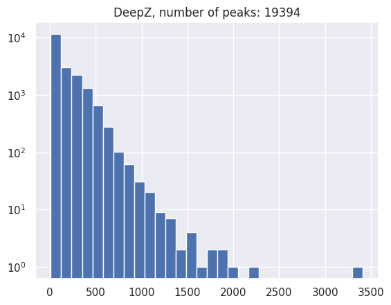 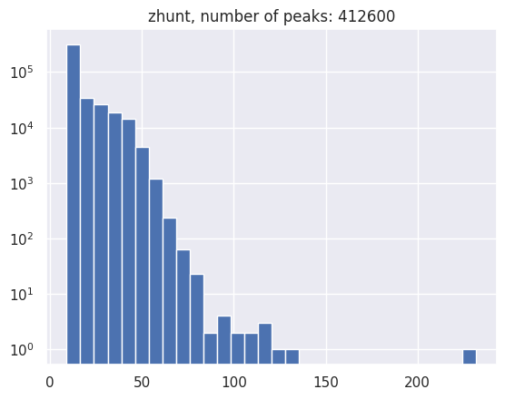
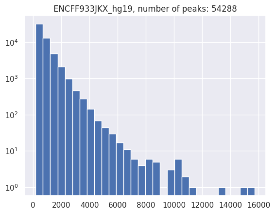 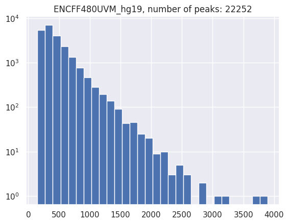
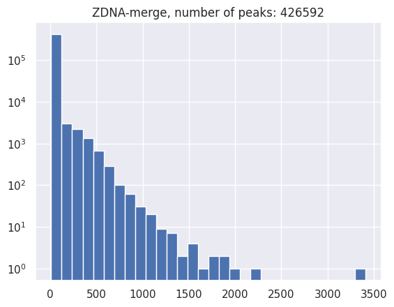

Тут мы посмотрели и распределение длин участков вторичной структуры ДНК.

С помощью написанного скрипта пофильтровал длины.

```bash
cd src
python3 filter_peaks.py
```

. Выбрал следующие границы длин:

* DeepZ: 800
* ENCFF480UVM_hg19: 1800
* ENCFF933JKX_hg19: 4000
* zhunt: 60

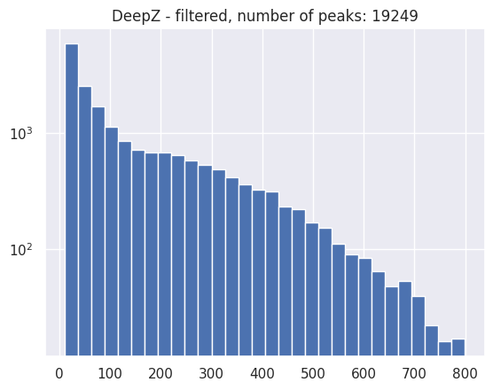 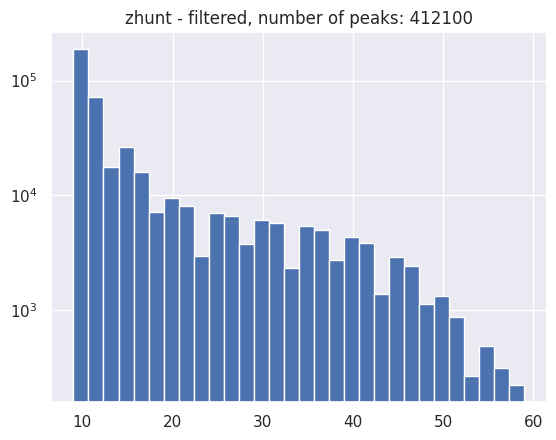
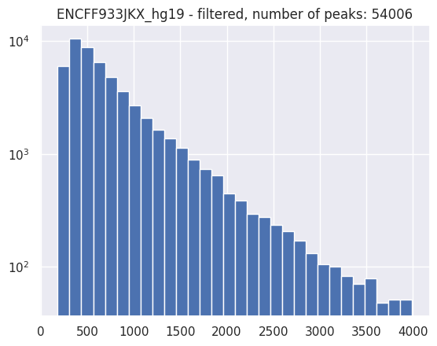 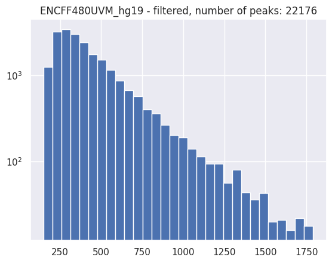

Как можно видеть, для Chip-SEQ-ов число убывает логарифмически. Для Z-DNA это сначала быстрее, потом посередине медленнее, потом снова быстро.

Теперь, чтобы посчитать распределение расположений гистоновой метки относительно аннотированных генов, скачаем разметку из UCSC и пересечём с пиками гистоновой метки.

Из UCSC я скачал следующие данные:

* ncbi_ref_seq_3_UTR_Exons.txt -- 3' UTR
* ncbi_ref_seq_5_UTR_Exons.txt -- 5' UTR
* ncbi_ref_seq_Downstream_by_1000_bases.txt -- Promote, 1kb
* ncbi_ref_seq_Coding_Exons.txt -- Coding exones
* ncbi_ref_seq_Introns_plus_0_bases_at_each_end.txt -- Intrones

Объединение для файла `DeepZ-filtered.bed` выглядит так:
```bash
bedtools intersect -a data/DeepZ-filtered.bed -b data/ncbi_ref_seq_3_UTR_Exons.txt \
                                           data/ncbi_ref_seq_5_UTR_Exons.txt \
                                           data/ncbi_ref_seq_Downstream_by_1000_bases.txt \
                                           data/ncbi_ref_seq_Coding_Exons.txt \
                                           data/ncbi_ref_seq_Introns_plus_0_bases_at_each_end.txt \
                                           -names "3' UTR Exones" "5' UTR Exones" \ 
                                           "Promote, 1kb" "Coding exons" "Introns" \
                                           -wb > data/DeepZ-filtered-intersect.bed
```

Для остальных файлов (`zhunt-filtered.bed`, `ENCFF480UVM_hg19-filtered.bed`, `ENCFF933JKX_hg19-filtered.bed`, `ZDNA-merge.bed`) команды аналогичны.

Далее, с помощю скрипта построил круговые диаграммы.

```bash
cd src
python3 plot_pie_charts.py
```

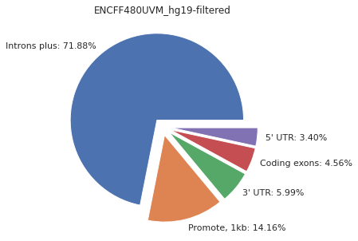 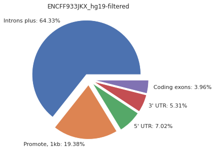
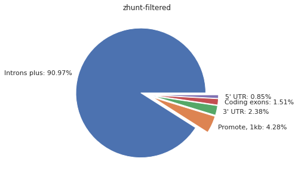 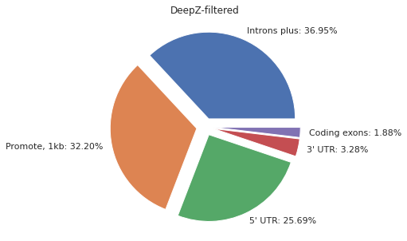
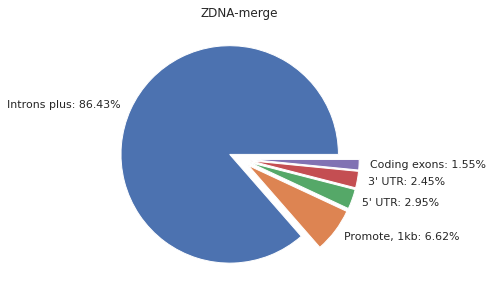

Тут можно видеть и данные про пересечения на участки вторичной структуры ДНК.

## Анализ пересечения гистоновой метки и вторичной структуры ДНК

Объединяем все гистоновые метки в один файл, чтобы можно было удобнее искать пересечения со вторинчой структурой:

```bash
cat data/*hg19-filtered.bed | sort -k1,1 -k2,2n | bedtools merge > data/H3F3A_hg19-merge.bed
```

Теперь объекдинённый файл можно пересекать с файлом участков вторичной структуры.

```bash
bedtools intersect -a data/ZDNA-merge.bed -b data/H3F3A_hg19-merge.bed > data/H3F3A_hg19-intersect_with_ZDNA.bed
```

Полученные файлики можно визуализировать в геномном браузере -- я выбрал UCSC Browser. Для этого я использовал следующий код в геномный браузер:

```
track visibility=dense name="ENCFF480UVM_hg19-filtered.bed" color=50,50,200 description="ENCFF480UVM_hg19-filtered.bed"
https://raw.githubusercontent.com/ShishckovA/hse21_H3F3A_ZDNA_human/master/data/ENCFF480UVM_hg19-filtered.bed
track visibility=dense name="ENCFF933JKX_hg19-filtered.bed" color=50,50,200 description="ENCFF933JKX_hg19-filtered.bed"
https://raw.githubusercontent.com/ShishckovA/hse21_H3F3A_ZDNA_human/master/data/ENCFF933JKX_hg19-filtered.bed
track visibility=dense name="ChIP_merge" color=50,50,200 description="H3F3A_hg19-merge.bed"
https://raw.githubusercontent.com/ShishckovA/hse21_H3F3A_ZDNA_human/master/data/H3F3A_hg19-merge.bed
track visibility=dense name="ZDNA" color=200,0,0 description="Merged ZDNA"
https://raw.githubusercontent.com/ShishckovA/hse21_H3F3A_ZDNA_human/master/data/ZDNA-merge.bed
track visibility=dense name="H3F3A_hg19 intersected with ZDNA" color=0,200,0 description="Intersected with ZDNA"
https://raw.githubusercontent.com/ShishckovA/hse21_H3F3A_ZDNA_human/master/data/H3F3A_hg19-intersect_with_ZDNA.bed
```

Полученная сессия:
<a href="https://genome.ucsc.edu/s/ShishckovA/H3F3A_ZDNA_human"> https://genome.ucsc.edu/s/ShishckovA/H3F3A_ZDNA_human</a>

Пересечения, которые я получил:

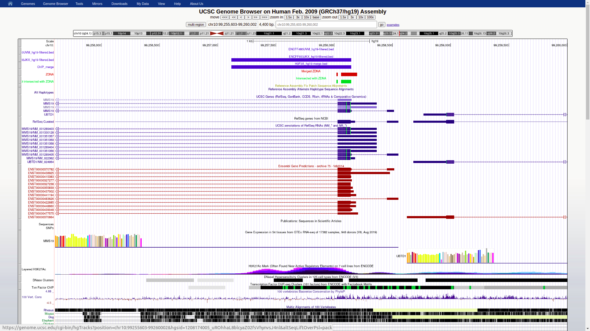
chr10:99,255,603-99,260,002

<br><br>

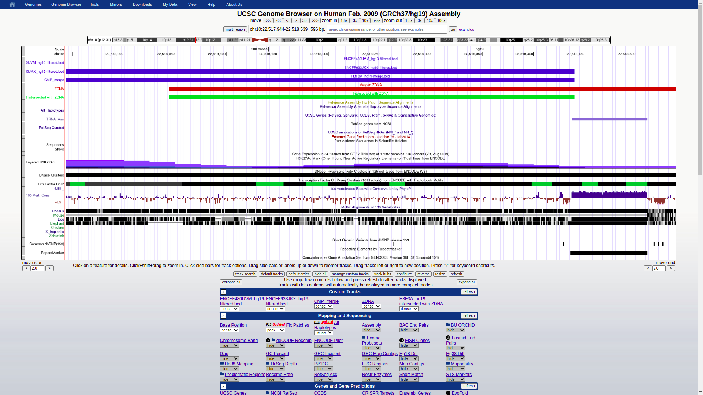
chr10:22,518,044-22,518,440


Чтобы ассоциировать полученные пересечения с ближайшими генами, скачаем из UCSC данные по генам и запустим `bedtools intersect`:


```bash
bedtools intersect -a data/H3F3A_hg19-intersect_with_ZDNA.bed -b data/hg19-genes.bed -wb > data/H3F3A_ZDNA_genes.bed
```

Далее, чтобы создать файлы с уникальными и повторяющимися генами, а также распечатать общее число пересечений с генами и уникальные пересечения, воспользуемся таким кодом:

```python
df_genes = pd.read_csv("data/H3F3A_ZDNA_genes.bed", sep="\t", comment="#", header=None, names=["chr", "s1", "e1", "chrom", "cdsStart", "cdsEnd", "bin", "name", "strand", "txStart", "txEnd",  "exonCount", "exonStarts", "exonEnds", "score", "name2", "cdsStartStat", "cdsEndStat", "exonFrames"])
with open("data/unique_genes.txt", "w") as f:
    for gene in df_genes.name2.unique():
        print(gene, file=f)
with open("data/all_genes.txt", "w") as f:
    for gene in df_genes.name2:
        print(gene, file=f)

print(len(df_genes.name2.unique()))
print(len(df_genes.name2))
```

В итоге мы получили, что общее число пересечений -- *13234*, число уникальных пересеченйи -- *2712*.

С помощью полученных файлов запустим GO-анализ на сайте <a href="http://pantherdb.org/">http://pantherdb.org/</a>

Вставим полученные гены в поле IDs, выбиерем организм "Homo sapiens" и выберем GO biological process complete. В качестве референсного списка выберем Homo sapiens genes.

Полученный результат анализа:

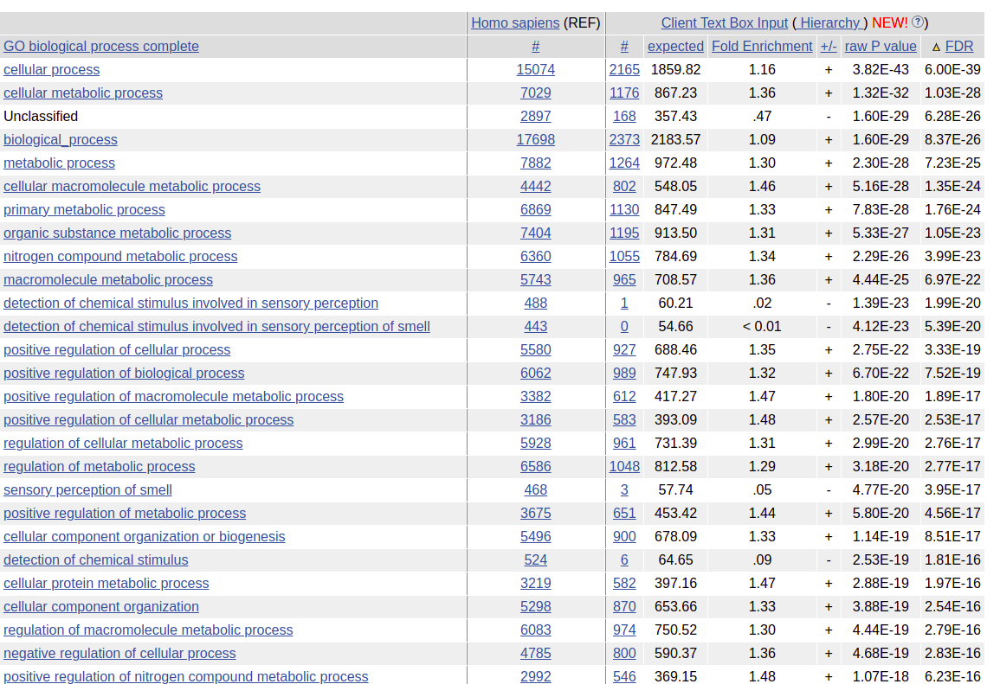

Отчёт по анализу находится в файле `data/pantherdb_GO_analysis.txt`.

Поскольку запуск производился с помощью Google Colab, считаю, что не лишним будет указать ссылку на ноутбук:
.<a href="https://colab.research.google.com/drive/1iCSeP-graQsdMVOwBe7eYMaB43ALJoCA?usp=sharing"> 
https://colab.research.google.com/drive/1iCSeP-graQsdMVOwBe7eYMaB43ALJoCA?usp=sharing</a>.

Там пояснений чуть меньше, зато весь код собран в одном месте и воспроизводим.


## Выводы

В этой работе я на практике самостоятельно ещё раз увидел, что такое .bed файлы с гистнововыми метками. Познакомился и могу использовать программу bedtools. Научился искать пересечение пиков в UCSC-браузере, а также открыл для себя GO-анализ.


Спасибо!

